# SmartRestaurantAutomation

Kafe ve restoranlar için geliştirilen, **hızlı satış** (kasadan anlık) ve **masa bazlı sipariş** (garson → masa → kasa) akışlarını destekleyen **C# WinForms + DevExpress** tabanlı otomasyon.  
Rezervasyon, masraf girişi ve gün sonu (ciro) raporu gibi modülleri içerir.

---

## 🎯 Kullanım Senaryoları

- **Hızlı Satış:** Müşteri ürünleri seçer → ödeme alınır → işlem biter.  
- **Masa Bazlı Sipariş:** Garson siparişi **masaya kaydeder** → müşteri kasaya gelir, **masa numarası** ile ödeyerek ayrılır.

---

## 🚀 Başlıca Özellikler

- **Satış & Ödeme:** Kategori bazlı ürün seçimi, sepet, toplam ve tahsilat (nakit/kart vb.)
- **Masalar:** Masa durum kartları, masa özelinde sipariş oluşturma/kaydetme
- **Rezervasyon:** Masa & saat rezerve etme, listeleme
- **Masraf Girişi:** Gün içi işletme harcamalarının kaydı ve listesi
- **Raporlama:** Gün sonu **toplam satış, toplam masraf, net kâr** özetleri
- **Çıkış Onayı & Basit Yetkilendirme**

---

## 🔐 Roller & Yetkiler

- **Müdür (Admin):** Rapor ve Masraf Girişi dahil **tüm** modüller  
- **Kasiyer:** Satış, Masalar, Ödeme  
- **Garson:** Masalar, Rezervasyon(lar)

> **Not:** **Gün Sonu Raporu** ve **Masraf Girişi** ekranları yalnızca **müdür (admin)** tarafından görüntülenir.

---

## 🧰 Teknolojiler

- **C# WinForms**
- **DevExpress WinForms** bileşenleri
- **MySQL 8.x** (veri saklama)
- **MySQL Connector/NET** (ADO.NET)
- .NET hedefi: (projene göre ekleyin – **.NET Framework 4.8** veya **.NET 6/7 WinForms**)

---

## ⚙️ Kurulum (Kısa)

1. **MySQL** üzerinde bir veritabanı oluşturun (ör. `restoran_otomasyonu`, `utf8mb4`).  
2. Tablo şemasını içe alın (projenin SQL şeması).  
3. `App.config` içinde bağlantı dizesini aşağıdaki gibi güncelleyin:
   ```xml
   <connectionStrings>
     <add name="Db"
          connectionString="Server=localhost;Database=restoran_otomasyonu;Uid=root;Pwd=YOUR_PASSWORD;SslMode=None;"
          providerName="MySql.Data.MySqlClient" />
   </connectionStrings>
	
## 🖼️ Ekran Görüntüleri

<table>
  <tr>
    <td align="center">
      <a href="./docs/01-dashboard-anasayfa.png">
        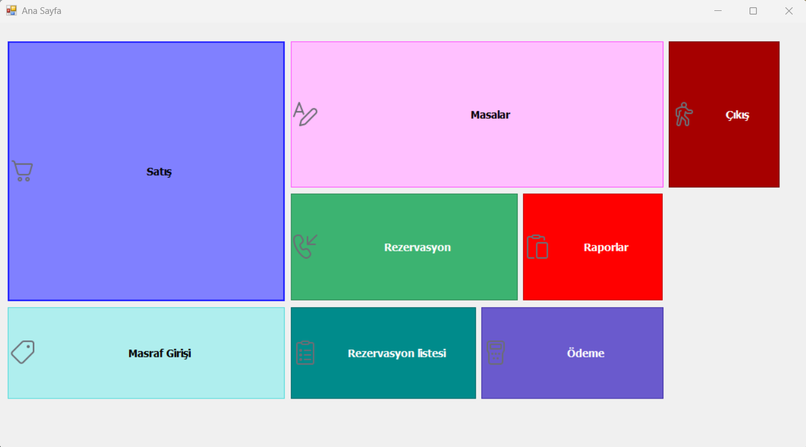
      </a><br>
      <sub>01 — Ana Sayfa (Dashboard) • <a href="./docs/01-dashboard-anasayfa.png">Dosya</a></sub>
    </td>
    <td align="center">
      <a href="./docs/02-quick-sale-drinks.png">
        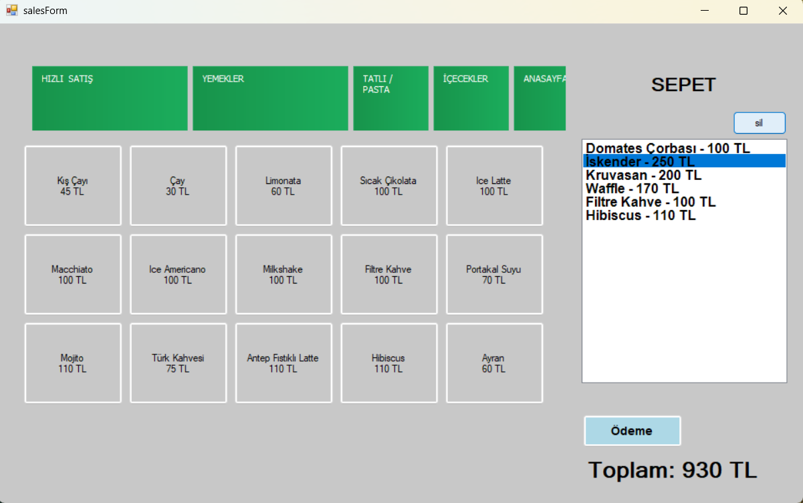
      </a><br>
      <sub>02 — Hızlı Satış – İçecekler • <a href="./docs/02-quick-sale-drinks.png">Dosya</a></sub>
    </td>
  </tr>

  <tr>
    <td align="center">
      <a href="./docs/03-payment-screen.png">
        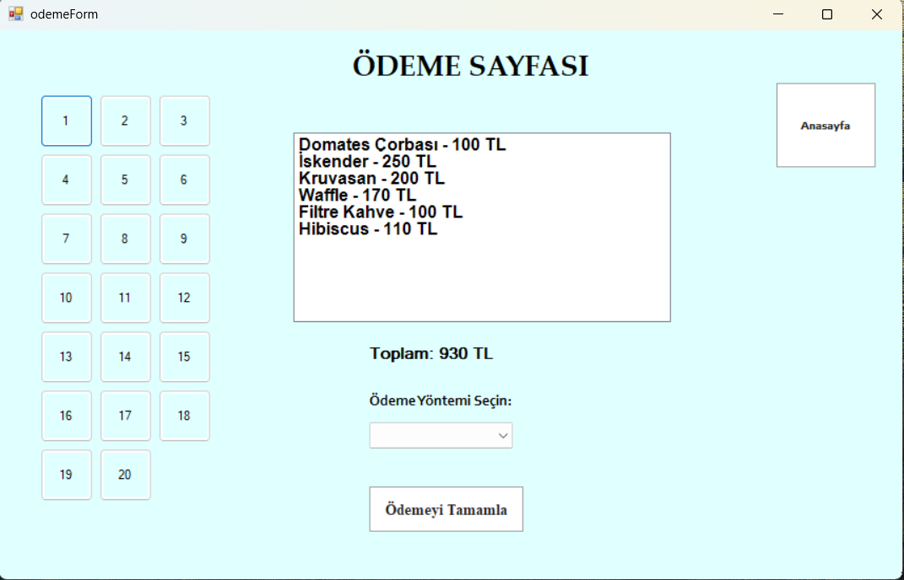
      </a><br>
      <sub>03 — Ödeme Ekranı • <a href="./docs/03-payment-screen.png">Dosya</a></sub>
    </td>
    <td align="center">
      <a href="./docs/04-tables-overview.png">
        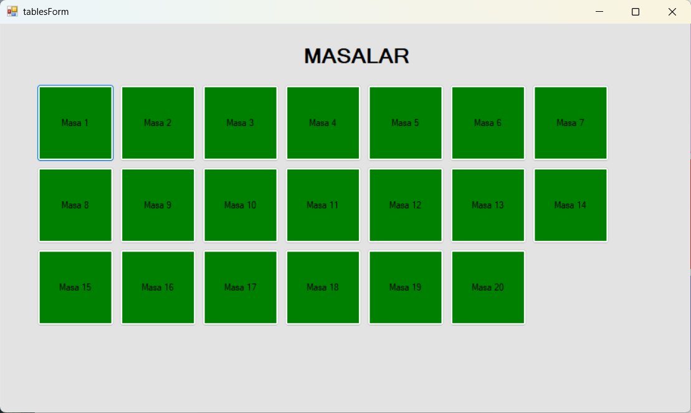
      </a><br>
      <sub>04 — Masalar Genel Görünüm • <a href="./docs/04-tables-overview.png">Dosya</a></sub>
    </td>
  </tr>

  <tr>
    <td align="center">
      <a href="./docs/05-quick-sale-foods.png">
        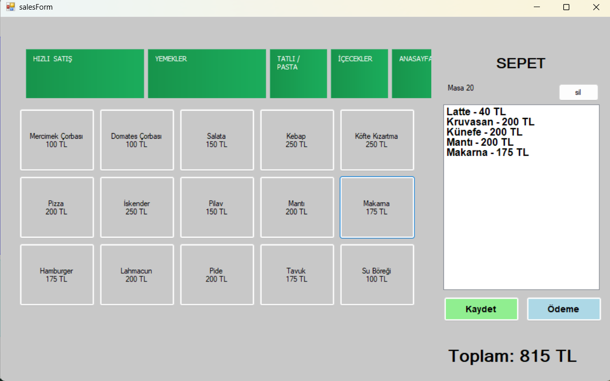
      </a><br>
      <sub>05 — Hızlı Satış – Yemekler • <a href="./docs/05-quick-sale-foods.png">Dosya</a></sub>
    </td>
    <td align="center">
      <a href="./docs/06-order-save-success.png">
        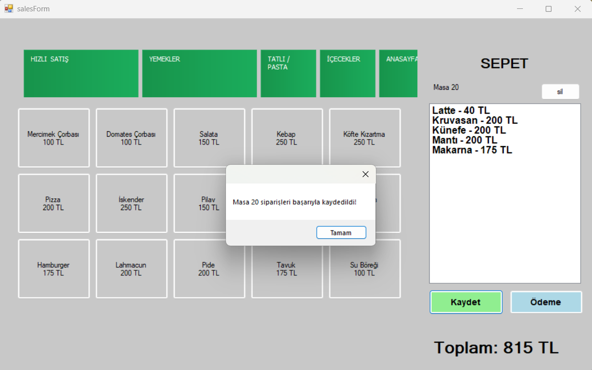
      </a><br>
      <sub>06 — Sipariş Kaydetme – Başarılı • <a href="./docs/06-order-save-success.png">Dosya</a></sub>
    </td>
  </tr>

  <tr>
    <td align="center">
      <a href="./docs/07-payment-success.png">
        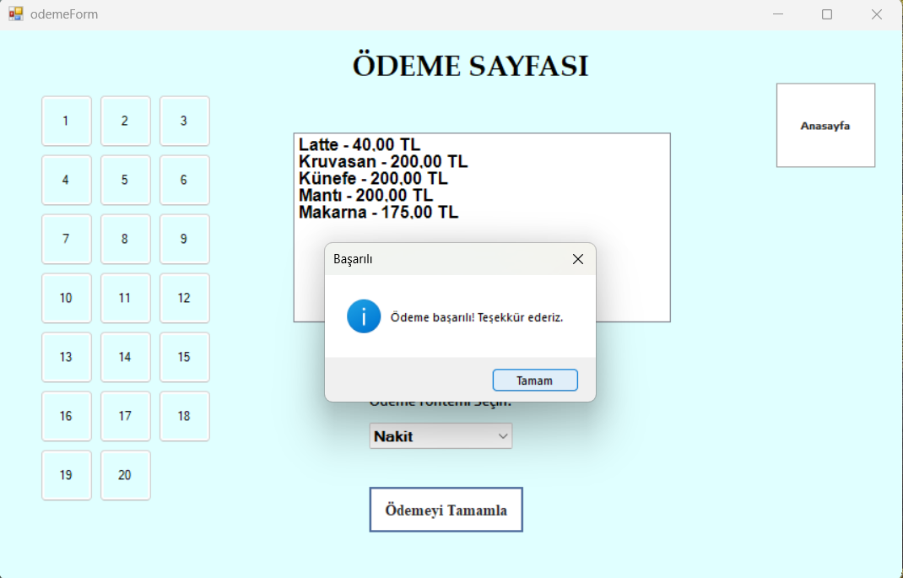
      </a><br>
      <sub>07 — Ödeme Başarılı • <a href="./docs/07-payment-success.png">Dosya</a></sub>
    </td>
    <td align="center">
      <a href="./docs/08-reservation-create.png">
        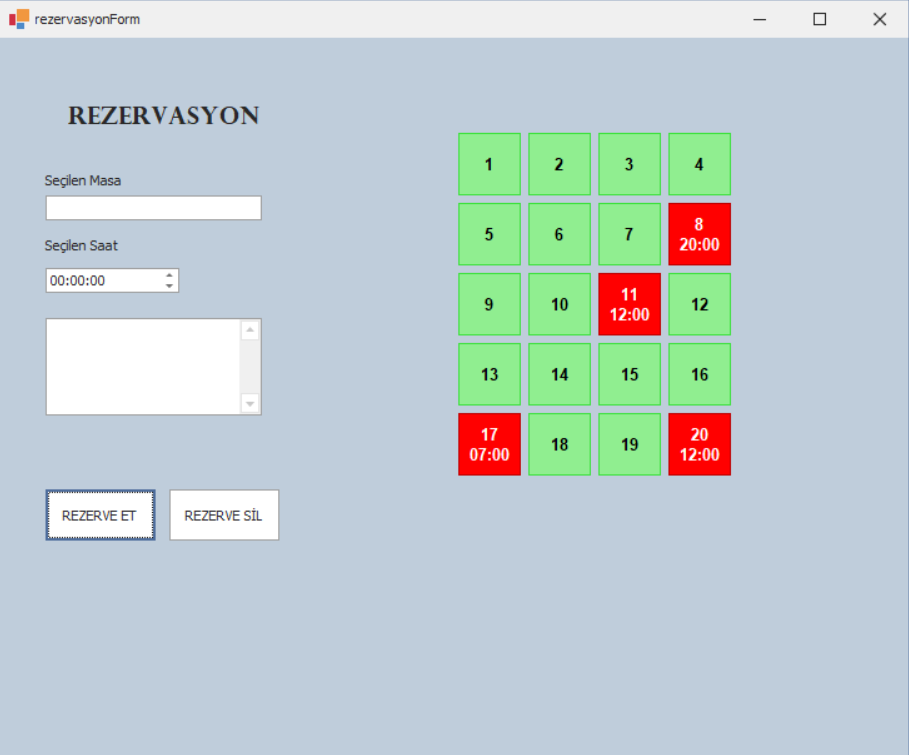
      </a><br>
      <sub>08 — Rezervasyon Oluşturma • <a href="./docs/08-reservation-create.png">Dosya</a></sub>
    </td>
  </tr>

  <tr>
    <td align="center">
      <a href="./docs/09-reservation-list.png">
        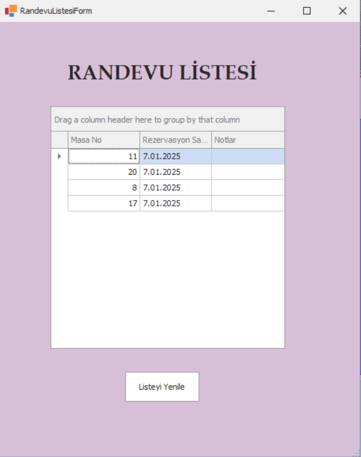
      </a><br>
      <sub>09 — Rezervasyon Listesi • <a href="./docs/09-reservation-list.png">Dosya</a></sub>
    </td>
    <td align="center">
      <a href="./docs/10-expense-entry.png">
        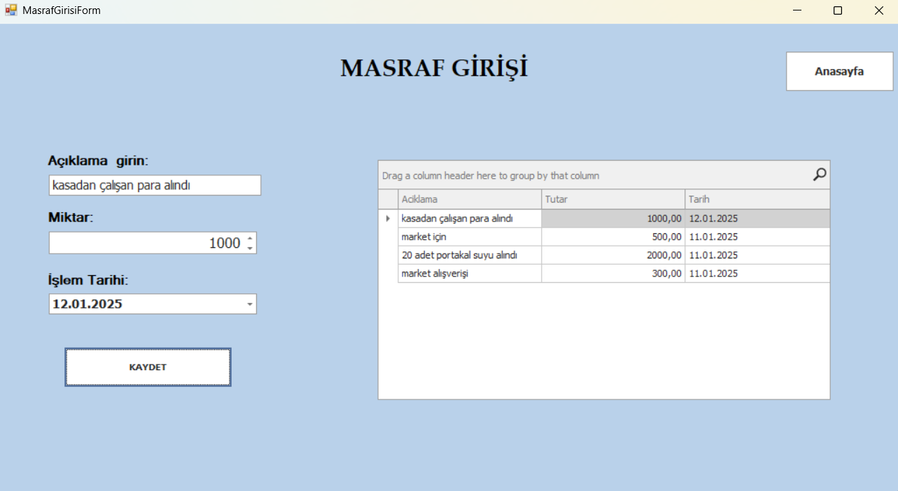
      </a><br>
      <sub>10 — Masraf Girişi • <a href="./docs/10-expense-entry.png">Dosya</a></sub>
    </td>
  </tr>

  <tr>
    <td align="center">
      <a href="./docs/11-admin-login.png">
        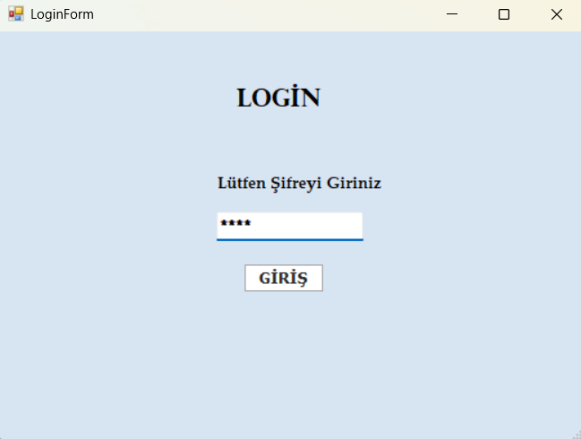
      </a><br>
      <sub>11 — Yönetici Girişi • <a href="./docs/11-admin-login.png">Dosya</a></sub>
    </td>
    <td align="center">
      <a href="./docs/12-end-of-day-report.png">
        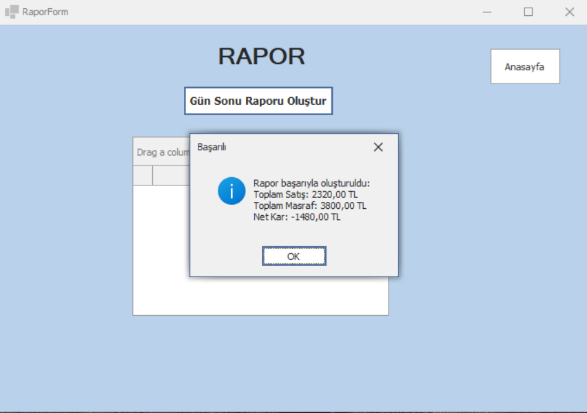
      </a><br>
      <sub>12 — Gün Sonu Raporu (Ciro) • <a href="./docs/12-end-of-day-report.png">Dosya</a></sub>
    </td>
  </tr>

  <tr>
    <td align="center">
      <a href="./docs/13-exit-confirmation.png">
        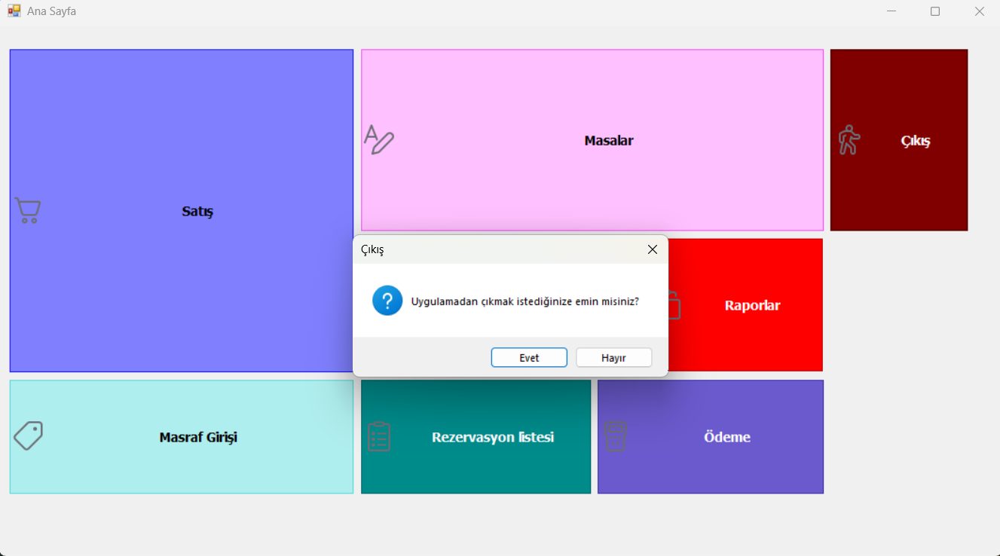
      </a><br>
      <sub>13 — Çıkış Onayı • <a href="./docs/13-exit-confirmation.png">Dosya</a></sub>
    </td>
    <td align="center">
      <a href="./docs/14-db-expenses-query.pnge">
        
      </a><br>
      <sub>14 — DB – Masraflar Sorgusu • <a href="./docs/14-db-expenses-query.png">Dosya</a></sub>
    </td>
  </tr>
</table>
